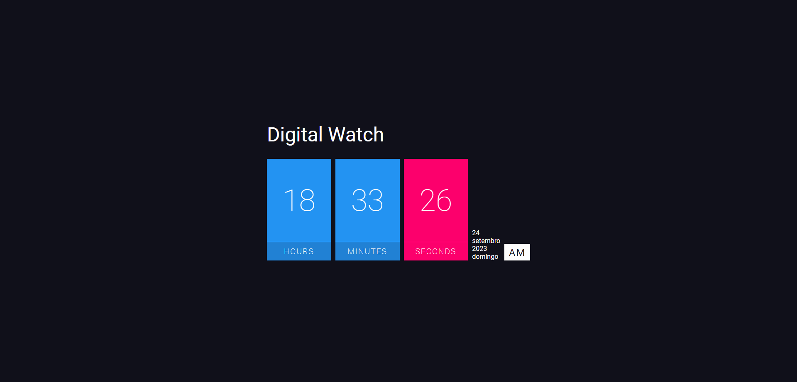

## [Relogio digital](https://afonso-front-end.github.io/projeto_bancario/)

Este é um simples projeto de relógio digital desenvolvido em [HTML CSS JS] que exibe a hora atual de forma digital. É uma aplicação minimalista que mostra a hora em um formato fácil de ler.

## Funcionalidades Principais

- Exibe a hora atual em um formato digital.
- Atualiza automaticamente para mostrar a hora atualizada.

## Tecnologias Utilizadas

- [HTML CSS JS]

## Pré-requisitos

- [Conhecimento em, HTML CSS JS]

## Contribuição

Sinta-se à vontade para contribuir com este projeto. Se você deseja adicionar recursos, resolver problemas ou melhorar a documentação, siga estas etapas:

1. Fork este repositório.
2. Crie um branch para a sua contribuição: `git checkout -b minha-contribuicao`
3. Faça as alterações desejadas e commit: `git commit -m 'Adicionei um novo recurso'`
4. Push para o branch: `git push origin minha-contribuicao`
5. Abra um pull request para revisão.

## Contato

- Nome: [Afonso]
- E-mail: [afonso.silva.as73@gmail.com]
- LinkedIn: [https://www.linkedin.com/in/afonso-silva-09b63b272/]
- Whatapp: [47 9 8889-5197]

 
